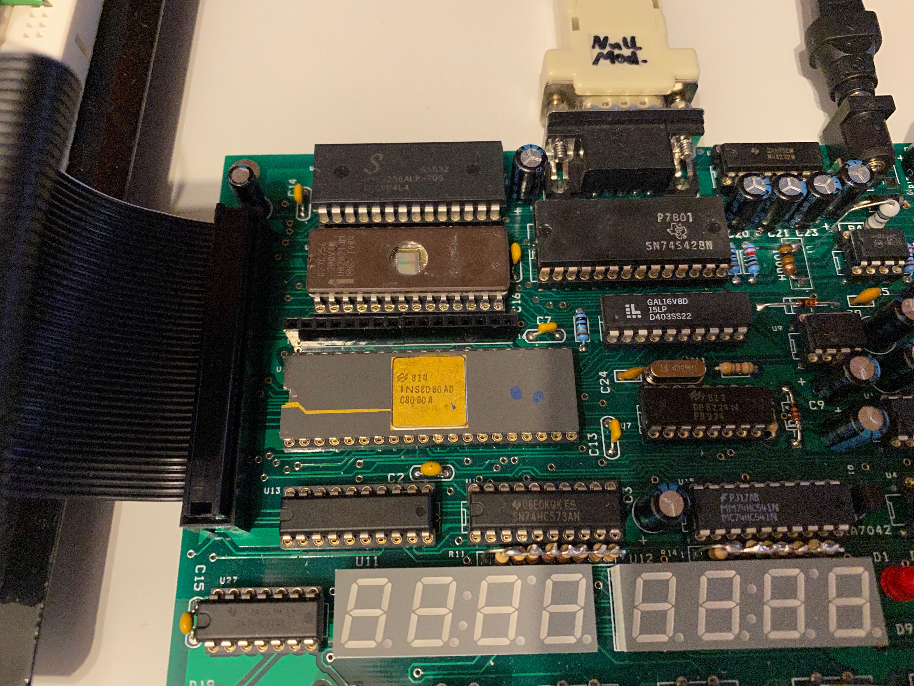
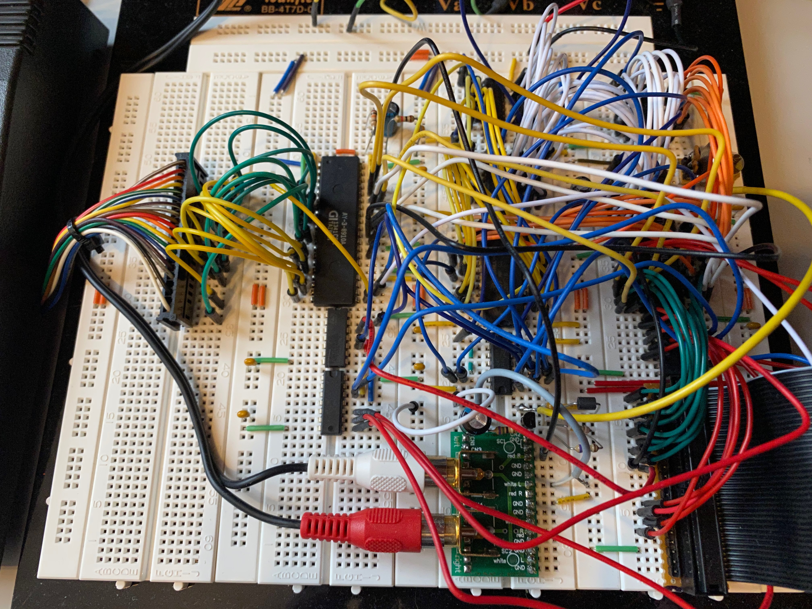
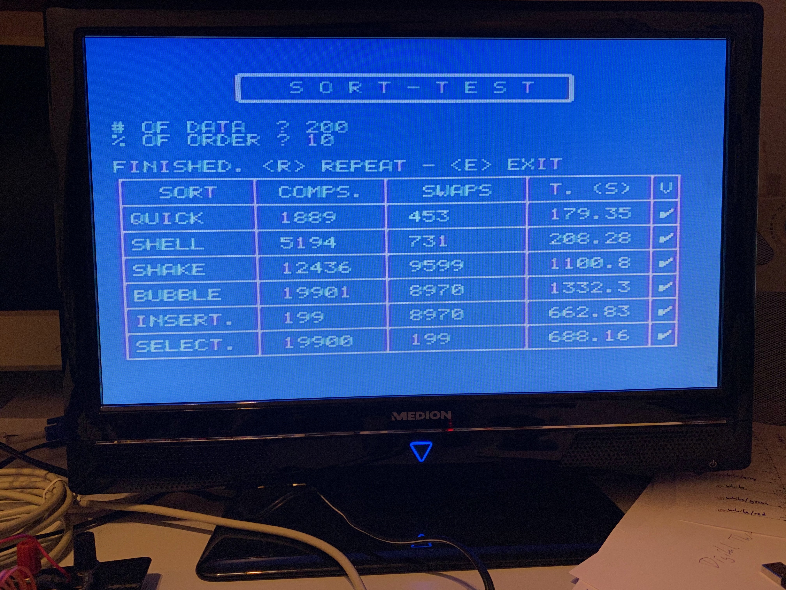
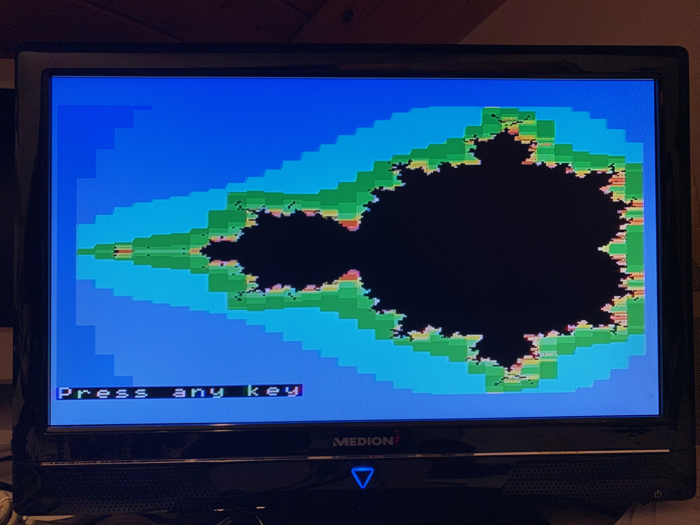

# 8080_Home_Computer
Home computer with video &amp; sound using an 8080 or 8085 single board computer. The computer
runs NASCOM BASIC version 4.7 with great extensions created by Grant Searle and Leonardo Miliani,
which I have ported from the Z80 to the 8080 CPU.

The picture above shows the entire hardware setup consisting of the 8080 Microprocessor Kit (the 
green PCB with the multicoloured keys on the right), the video display and sound generation board (the breadboard
in the middle), an RS232 connection to a PC (not shown), and a C16 keyboard (shown left) attached to the
video and sound extension board. The employed video display processor (VDP) is a TMS9918A, the 
programmable sound generator (PSG) is an AY-3-8910. 

The [8080 Microprocessor Kit](http://www.kswichit.com/8080kit/8080kit.htm) 
shown above is a single board computer developed by [Wichit Sirichote](http://www.kswichit.com/)
offering a 2.048 MHz clocked 8080 CPU, 32KB EEPROM and 32KB RAM, a 7-segment
LED display, a hexadecimal keyboard plus 12 function keys, a bit-banged 2400 bps serial interface, 
and a 100Hz timer generating periodic interrupts. The board provides a 40pin extension connector,
which is used to connect it to the video and sound extension board on the breadboard.
The board comes with a simple monitor program to view and modify the RAM contents
and the CPU registers, to upload user programs into the RAM, and to disassemble 8080 program
code. The monitor program can be operated from the built-in keypad or over an
attached serial terminal (e.g. a PC). I ordered the plain PCB directly from 
Wichit Sirichote by email, which went very well. Since I already had nearly all 
components at hand, I did not order the full kit. With the help of the excellent manual 
and instructions, which can be downloaded from 8080 Kit web page, it was 
not difficult to assemble the computer and get it running.

The video and sound extension board shown above consists of the 
video display processor (VDP) TMS9918A, a 32KB 62256 SRAM used as dedicated
graphics memory (only 16KB are used), the programmable sound generator (PSG)
AY-3-8910, some 74HC chips for address decoding, three 8-bit buffers to interface
the VDP to the SRAM, and a few discrete components to drive the NTSC composite 
video output and the (mono) audio output. The PSG chip offers two 8-bit I/O ports,
which are used to interface to a Commodore C16 keyboard. The C16 keyboard is
organized as an 8x8 matrix of keys. The schematics for the video and sound
part (including the keyboard connection) were adapted from the 
[LM80C homebrew computer project](https://github.com/leomil72/LM80C)
and all credits go to [Leonardo Miliani](https://www.leonardomiliani.com/en/).
I have just created a new address decoding logic that fits to the 
8080 Microprocessor Kit SBC.

Here are screenshots of some BASIC programs taken from the [LM80C repository](https://github.com/leomil72/LM80C).
They use the extended set of BASIC commands of the LM80C computer.

Sorting algorithms - [LM80C-R210-sorting-algorithms.bas](https://github.com/leomil72/LM80C/blob/master/BASIC%20examples/LM80C-R210-sorting-algorithms.bas)

In this program execution 200 numbers were sorted; 10% of the numbers were presorted. 
It would be nice to compare the runtimes with the original LM80C Z80 computer. 
Note, that the 8080 SBC runs at 2.048 MHz and that the 8080 CPU needs more 
clock periods / machine cycles to perform the instructions than the Z80.

Same demo program as before, but now only 20 numbers were sorted and 0% were ordered before.

Othello game - [LM80C-R21-othello.bas](https://github.com/leomil72/LM80C/blob/master/BASIC%20examples/LM80C-R21-othello.bas)

Mandelbrot graphics computation - [Mandelbrot Multicolor Version 2.bas](https://github.com/leomil72/LM80C/blob/master/BASIC%20examples/mandelbrot.bas)

