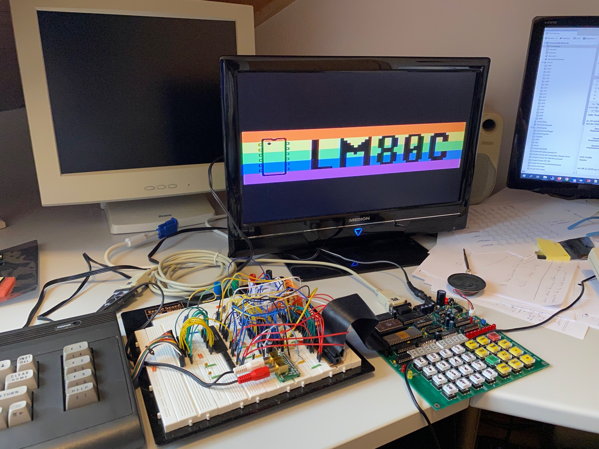

# 8080_Home_Computer
Home computer with video &amp; sound using an 8080 or 8085 single board computer. The computer
runs NASCOM BASIC version 4.7 with great extensions created by Grant Searle and Leonardo Miliani,
which I have ported from the Z80 to the 8080 CPU. This is a hobby project I created 
to relax a bit from work.

## Hardware

The picture above shows the entire hardware setup consisting of the 8080 Microprocessor Kit (the 
green PCB with the multicoloured keys on the right), the video display and sound generation board 
(the breadboard in the middle), an RS232 connection to a PC (not well visible), and 
a C16 keyboard (shown left) attached to the video and sound extension board. The employed 
video display processor (VDP) is a TMS9918A, the programmable sound generator (PSG) is an AY-3-8910. 

### Mainboard

The [8080 Microprocessor Kit](http://www.kswichit.com/8080kit/8080kit.htm) 
shown above is a single board computer developed by [Wichit Sirichote](http://www.kswichit.net/)
offering a 2.048 MHz clocked 8080 CPU, 32KB EPROM and 32KB RAM, a 7-segment
LED display, a hexadecimal keyboard plus 12 function keys, a bit-banged 2400 bps serial interface, 
and a 100Hz timer generating periodic interrupts. The board provides a 40pin extension connector,
which is used to connect it to the video and sound extension board on the breadboard.
The board comes with a small monitor program to view and modify the RAM contents
and the CPU registers, to upload user programs into the RAM, and to disassemble 8080 program
code. The monitor program can be operated from the built-in keypad or over an
attached serial terminal (e.g. a PC). I ordered the plain PCB directly from 
Wichit Sirichote by email, which went very well. Since I already had nearly all 
components at hand, I did not order the full kit. With the help of the excellent manual 
and instructions, which can be downloaded from the 8080 Kit web page, it was 
not difficult to assemble the computer and get it running. BTW, the date code 
on the CPU shows "814", which means it was produced in the 14th week of 1978 - more 
than 45 years ago, and it is still working! 

### Video &amp; Sound Extension Board with Keyboard Interface

The video and sound extension board shown above consists of the 
video display processor (VDP) TMS9918A, a 32KB 62256 SRAM used as dedicated
graphics memory (only 16KB are used), the programmable sound generator (PSG)
AY-3-8910, some 74HC(T) chips for address decoding, three 8-bit buffers to interface
the VDP to the SRAM, and a few discrete components to drive the NTSC composite 
video output and the (mono) audio output. The PSG chip offers two 8-bit I/O ports,
which are used to interface to a Commodore C16 keyboard. The C16 keyboard is
organized as an 8x8 matrix of keys. The schematics for the video and sound
part (including the keyboard connection) were adapted from the 
[LM80C homebrew computer project](https://github.com/leomil72/LM80C)
and all credits go to [Leonardo Miliani](https://www.leonardomiliani.com/en/).
I have just created a new address decoding logic that fits to the 
8080 Microprocessor Kit SBC. 

The schematics can be found in the [hardware](hardware/) folder. They were created using 
[KiCad 5.1.8](https://kicad.org/). I have modified or added some components 
like the PSG AY-3-8910 and they are included in the file 
`Video+Sound_Board_for_8080_Microprocessor_Kit-cache.lib`.

## Software

The 8080 Home Computer runs NASCOM BASIC 4.7 with great extensions created by 
[Grant Searle for his Z80 SBC designs](http://searle.wales/) and Leonardo 
Miliani for his [homebrew Z80 computer LM80C](https://github.com/leomil72/LM80C). 
Since my computer employs an (older) 8080 CPU instead of the 
(newer) Z80 CPU, the Z80 source code had to be ported (or call it downgraded!) 
to the 8080 CPU. The Z80 is backwards compatible with the 8080, 
which means that the 8080 instruction set and the register set 
is a subset of those provided by the Z80. Therefore, a good share 
of Z80 code could be adapted immediately for running on an 8080 or 8085 
(the 8085 is compatible with the 8080, and only has two new instructions). 
However, the Z80 has additional registers, status flags, 
and instructions (with new addressing modes, too) compared to the 8080/8085 
and code that was using these had to be rewritten using the more 
limited 8080 instructions, status flags, and registers. 
I chose a manual approach for porting the software, i.e. I went through 
all the source code and replaced all instruction mnemonics and 
operands. This took quite some time, but I learned a lot from this, and 
especially when Z80 specific instructions and register uses were encountered, 
you would have to manually create a workaround anyway. 
(As far as I know there is no automatic tool doing this.)

I first ported [Grant Searle's version of NASCOM BASIC 4.7b](http://searle.x10host.com/z80/SimpleZ80.html#RomFiles) 
to the 8080 CPU (and changed the I/O routines to work with the 8080 Microprocessor Kit), 
before I came across Leonardo Miliani's LM80C project and then have incrementally
ported most of the LM80C software parts to the 8080 CPU, too. The software 
adapted from the LM80C project especially added the VDP and PSG driver 
routines, the new graphics and sound BASIC commands, the timer interrupt 
service routine, and the handling of the C16 keyboard. The fonts were
adopted from the LM80C project without change. I have also adapted 
most parts of the hardware initialization routines, which is the reason 
why the computer shows the LM80C logo at boot time (see image below).
All credits for the implemented BASIC go to Microsoft (NASCOM BASIC
was developed by them), Leonardo Miliani, and Grant Searle.
 

Once booted, the computer asks for entering the top memory address. 
If all available memory should be used for BASIC, only Return 
has to be pressed. Then the user can type in or load a 
BASIC program or can execute BASIC commands in direct mode,
i.e. directly from the command line. Loading of BASIC programs
has to be done via the serial interface using a suitable 
terminal program on the connected PC. I found that the 
Open Source terminal program [Tera Term](https://ttssh2.osdn.jp/) 
is working very well for this. When configuring the serial 
interface choose the proper COM port, 2400 bps, 8N1, no
hardware handshake and a character transmit delay of 80ms
and a line transmit delay of 500ms. The delays are important,
because the 8080 Microprocessor Kit used as the mainboard
does not have a serial interface chip (UART) and we cannot
use the hardware handshake protocol for the serial interface.
Instead, we have to give the computer enough time to process
each received character and newline and to make sure that
it is busy waiting for the next character on the serial
line before it is actually being sent. In order to load a BASIC
program simply load it in an editor application on the connected PC, 
select all text and copy it into the clipboard buffer (CTRL-C),
and then bring the terminal window to the front and paste
the text into it (CTRL-V). For longer programs this can take 
a while. 

The following screenshot shows a short BASIC program that
displays colour bars for all 15 colors supported by the TMS9918A VDP.

Here is the program output:

The following photos show screenshots of some BASIC programs taken from the [LM80C repository](https://github.com/leomil72/LM80C).
They use the extended set of BASIC commands of the LM80C computer.

Sorting algorithms - [LM80C-R210-sorting-algorithms.bas](https://github.com/leomil72/LM80C/blob/master/BASIC%20examples/LM80C-R210-sorting-algorithms.bas)

During this program execution 200 numbers were sorted; 10% of the numbers were presorted. 
It would be nice to compare the runtimes with the original LM80C Z80 computer. 
Note, that the 8080 SBC runs at 2.048 MHz and that the 8080 CPU needs more 
clock periods / machine cycles to perform the same instructions than the Z80.

Same demo program as before, but now only 20 numbers were sorted and 0% were ordered before.

Othello game - [LM80C-R21-othello.bas](https://github.com/leomil72/LM80C/blob/master/BASIC%20examples/LM80C-R21-othello.bas)

Mandelbrot graphics computation - [Mandelbrot Multicolor Version 2.bas](https://github.com/leomil72/LM80C/blob/master/BASIC%20examples/mandelbrot.bas)

## Next Steps

The integration and porting of Leonardo Miliani's source code for the LM80C
to the 8080 CPU and the 8080 Microprocessor Kit SBC has to be finished.
I first ported Grant Searle's version of NASCOM BASIC 4.7b to the 8080, before
I came across Leonardo Miliani's LM80C project. Therefore, I added features and 
source code from the LM80C project only incrementally into my project. As a result
the structure of my source code is in parts differing from the LM80C source
code. I also had to take into account that in my project I did not have
a C16 keyboard in the beginning (I bought one from EBay only recently) and
only a bit-banged serial interface, which makes it difficult to deal
with the periodic timer interrupts (causing the serial interface to miss
the start bit of an incoming byte). After I received the C16 keyboard I 
ported the respective source code parts from the LM80C. It works, and the user can
type texts and BASIC commands which are shown in the video display,
but when pressing the Return key nothing happens. If the same commands
are entered over the serial interface (and they are also shown in the
video display), they are executed, though.

Before I can upload the source code it needs some cleaning, and proper 
comments and credits have to be put at the beginning of each file. 
Also, I am currently designing and implementing my own splash logo 
shown during system boot.

### Further Ideas and Plans
  
* Integrate BASIC together with the monitor program into the 32KB EPROM.
  Currently, the BASIC is assembled and uploaded via the serial interface
  into the 32KB RAM using the monitor program. The advantage of this approach is that
  after making changes to the BASIC source code the assembled file can directly
  be uploaded to the system without burning another EPROM. The disadvantage is
  that only 11KB of RAM remain free for BASIC programs. Once the BASIC has
  been fully debugged, I will bring the monitor source code and the 
  BASIC source code into one assembler project and burn a new EPROM.

* Provide a second 40-pin connector on the video &amp; sound extension board
  that allows to connect the [MiniMax8085 SBC](http://www.malinov.com/Home/sergeys-projects/minimax8085) 
  developed by Sergey Kiselev as an alternative to the 8080 Microprocessor Kit SBC. 
  The MiniMax8085 also provides 32KB (E)EPROM and 32KB RAM and 
  a 40-pin extension connector. Since the pin assignments of the 40-pin connectors 
  are different for the two single board computers and the bus interface is slightly
  different, some glue logic will have to be modified or extended. Furthermore,
  the 8085 MiniMax provides a hardware USART chip (which the 8080 Microprocessor Kit
  doesn't have), but it lacks a timer chip to generate the 100Hz ticks. Probably
  the interrupt output of the TMS9918A can be used to generate 60Hz ticks instead.
  
* Creation of a PCB for the video &amp; sound extension board

* Install the 8080 SBC together with the video &amp; sound extension board
  in the C16 case to create a neat looking system

* Modify the BASIC ROM software in such a way that it can work with
  a variety of hardware configurations (with/without external keyboard,
  with/without video display processor, with/without programmable sound generator,
  with/without timer chip). It should be possible to run the BASIC already with
  the vanilla single board computers without any hardware extension. In this case,
  graphic and sound commands would need to be disabled.

* Add an I2C bus controller like the PCF8584 to be able to connect I2C
  devices like displays, sensors, actuators, and EEPROMs (e.g. for program
  storage). Create proper BASIC commands for I2C bus operation.
  
* Add a serial communication chip like the 8251 USART or 68B50 ACIA
  to avoid the problems with the bit-banged serial communication
  
